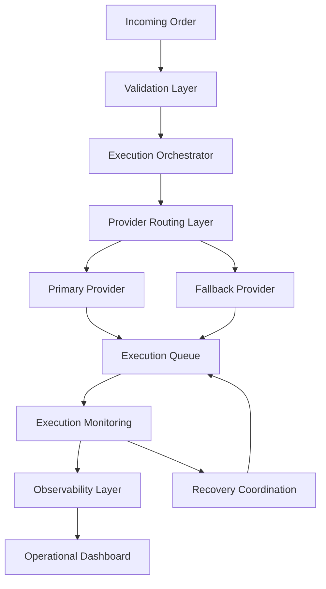

# Execution Flow

High-level execution flow architecture for DOOB operational infrastructure.

---

---

# Infrastructure Layers

## Validation Layer
Handles request validation, execution eligibility checks, and operational safeguards.

## Execution Orchestrator
Coordinates infrastructure workflows, execution states, and orchestration pipelines.

## Provider Routing Layer
Determines execution routing using provider health awareness and operational coordination logic.

## Execution Queue
Processes distributed execution workloads and replay-safe operational tasks.

## Observability Layer
Tracks operational telemetry, execution visibility, and infrastructure diagnostics.

## Recovery Coordination
Handles retry workflows, infrastructure recovery, and operational replay handling.
