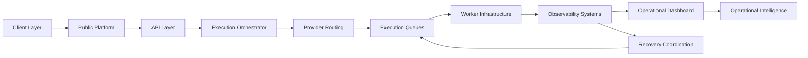

# Operational Topology

High-level operational topology for DOOB infrastructure coordination.

---

---

# Infrastructure Topology

## Public Platform
Handles user-facing operational interactions and execution requests.

## API Layer
Coordinates infrastructure communication, orchestration access, and operational request handling.

## Execution Orchestrator
Manages execution lifecycle coordination and operational workflow control.

## Provider Routing
Coordinates infrastructure routing, provider selection, and fallback orchestration.

## Execution Queues
Processes asynchronous execution workloads and operational task distribution.

## Worker Infrastructure
Handles distributed infrastructure execution and workload processing.

## Observability Systems
Tracks execution telemetry, infrastructure diagnostics, and operational visibility.

## Recovery Coordination
Supports replay-safe recovery handling and operational retry workflows.

## Operational Intelligence
Provides infrastructure-level operational analysis and coordination visibility.
