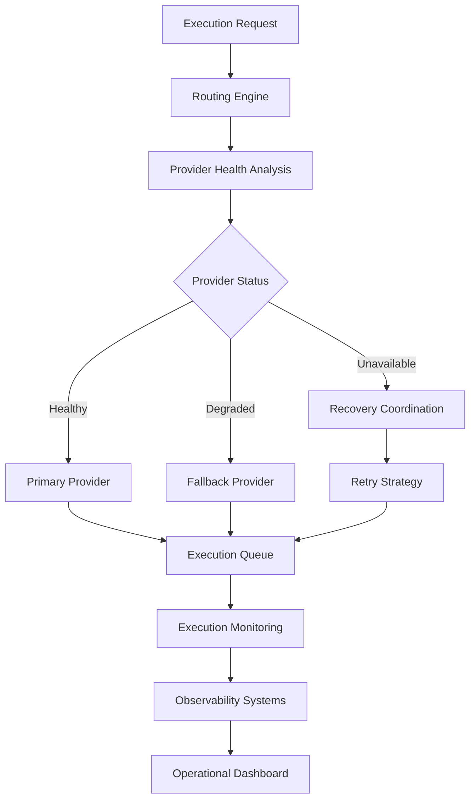

# Provider Routing Flow

High-level provider routing and fallback coordination architecture.

---

---

# Routing Concepts

## Routing Engine
Coordinates infrastructure-level provider selection and execution orchestration.

## Provider Health Analysis
Evaluates provider operational status, reliability, and execution readiness.

## Fallback Coordination
Handles failover routing when primary execution infrastructure becomes degraded or unavailable.

## Retry Strategy
Supports replay-safe operational recovery and execution retry coordination.

## Observability Systems
Tracks execution visibility, operational telemetry, and infrastructure diagnostics.
