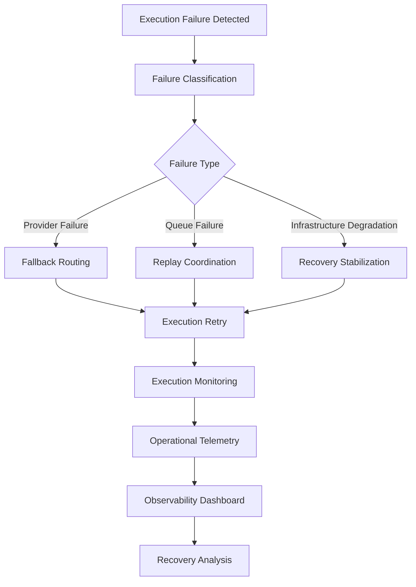

# Recovery Coordination Flow

High-level recovery coordination and infrastructure stabilization workflow.

---

---

# Recovery Infrastructure

## Failure Classification
Determines infrastructure failure category and operational recovery strategy.

## Fallback Routing
Coordinates provider-level failover and alternative execution routing.

## Replay Coordination
Handles replay-safe execution recovery and operational retry orchestration.

## Recovery Stabilization
Supports infrastructure recovery workflows and operational continuity handling.

## Operational Telemetry
Tracks infrastructure recovery visibility and execution diagnostics.

## Recovery Analysis
Provides operational insight into infrastructure recovery effectiveness and failure coordination patterns.
